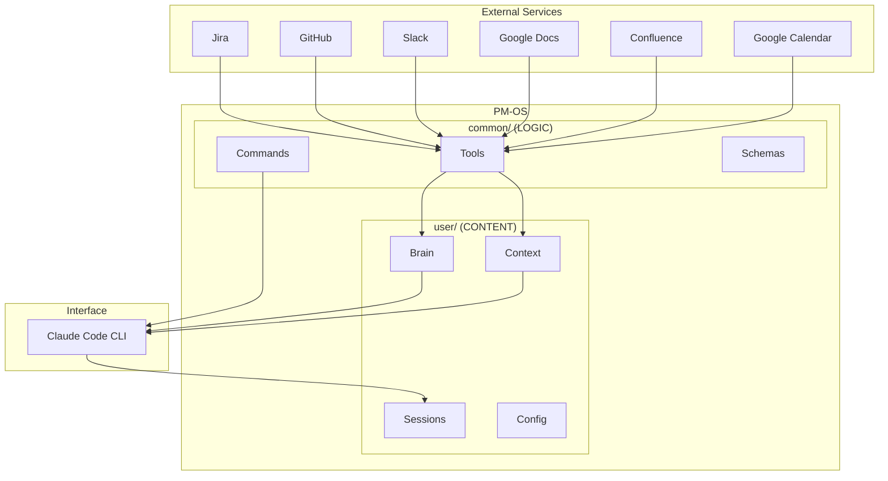
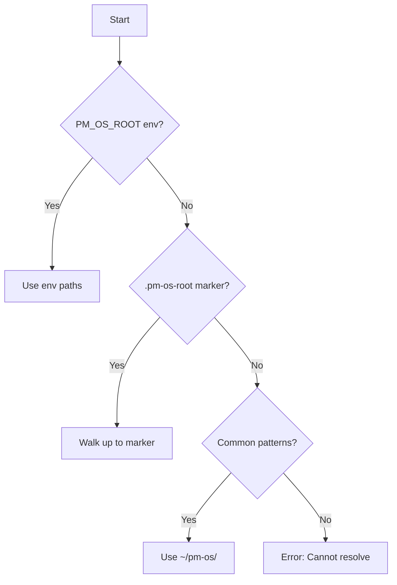
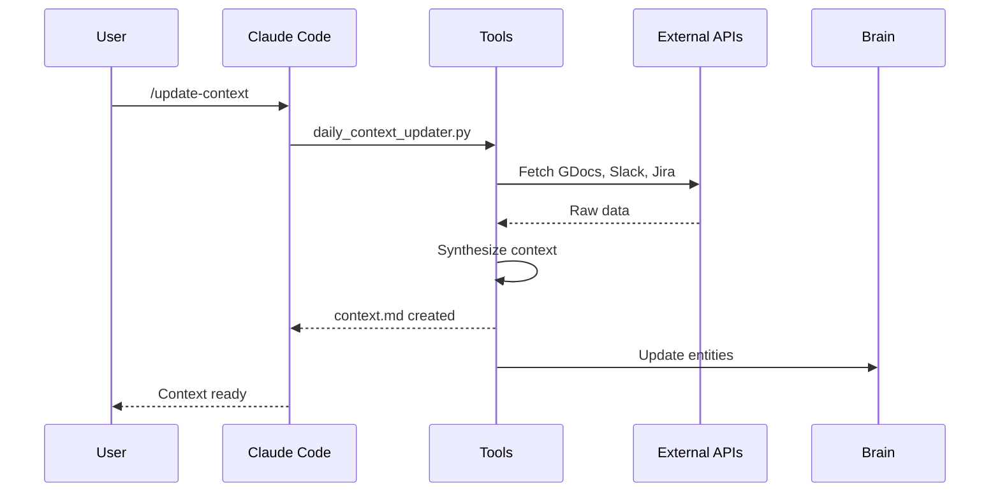
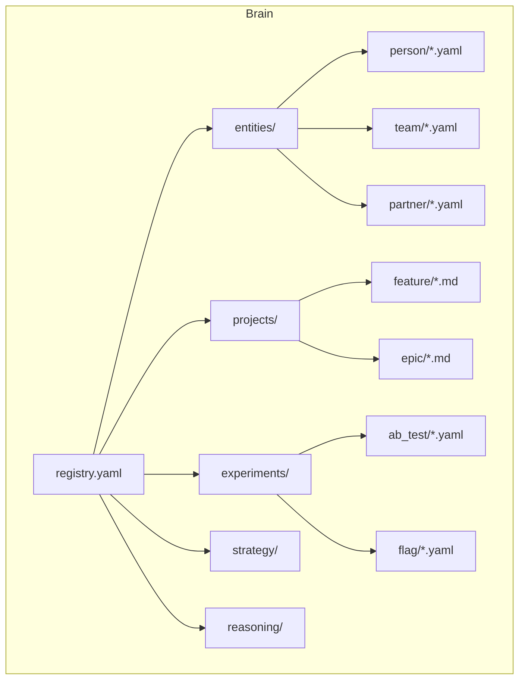
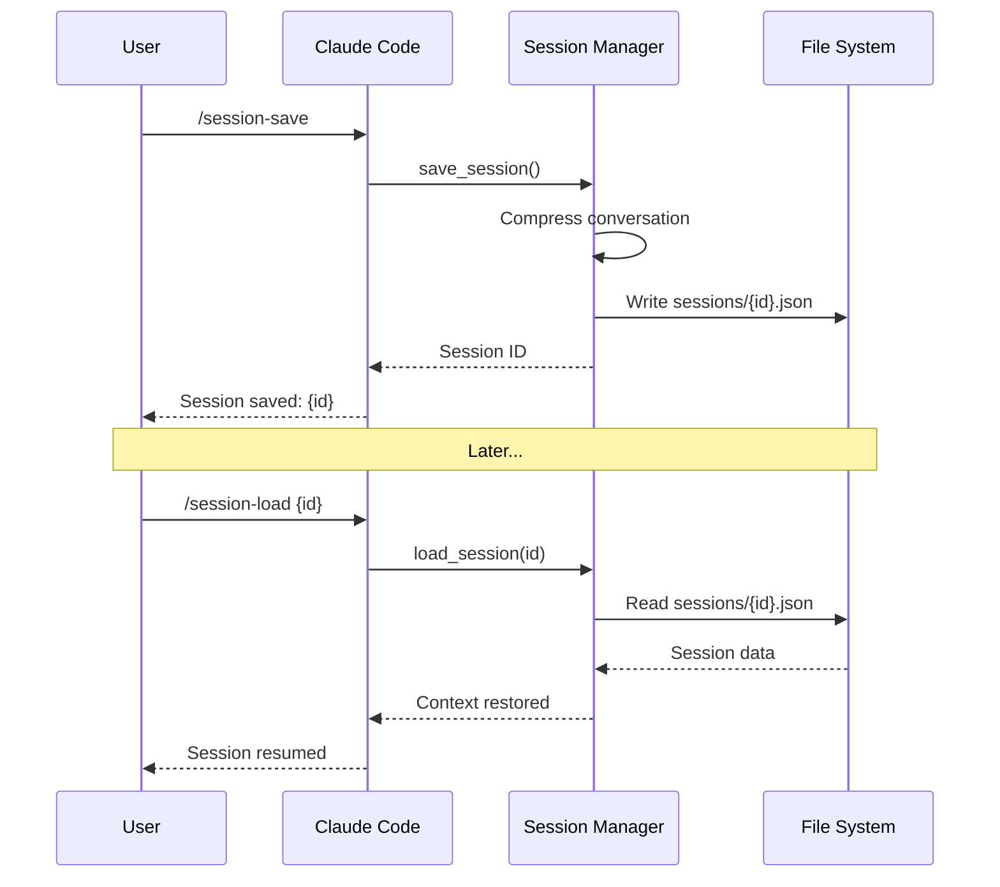
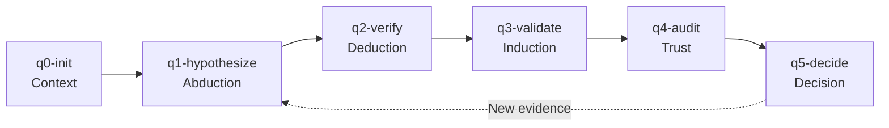

# PM-OS Architecture

> System architecture, integrations, and data flow

## System Overview



## Three-Folder Architecture

PM-OS v3.3 uses strict separation between code, data, and development:

### common/ (LOGIC)

Contains all executable code and is version-controlled:

```
common/
├── .claude/
│   └── commands/          # 76 slash commands (*.md)
├── tools/                 # 88+ Python tools
│   ├── brain/            # Brain management & enrichment
│   ├── boot/             # Boot orchestration
│   ├── daily_context/    # Context updater
│   ├── documentation/    # Documentation tools
│   ├── integrations/     # Jira, GitHub, Confluence, etc.
│   ├── slack/            # Slack integration
│   ├── meeting/          # Meeting preparation
│   ├── session/          # Session management
│   ├── reasoning/        # FPF tools
│   ├── push/             # Multi-repo publication
│   ├── preflight/        # System verification
│   ├── workspace/        # Workspace management
│   └── *.py              # Core utilities
├── schemas/              # 7 YAML schemas
├── documentation/        # This documentation
├── AGENT.md             # Agent entry point
└── VERSION              # Current version (3.3.0)
```

### user/ (CONTENT)

Contains all user data and personal configurations:

```
user/
├── brain/
│   ├── entities/        # People, teams, partners
│   ├── projects/        # Active projects
│   ├── experiments/     # A/B tests, flags
│   ├── strategy/        # OKRs, roadmaps
│   ├── reasoning/       # FPF cycles
│   ├── inbox/           # Unprocessed items
│   └── registry.yaml    # Entity registry
├── sessions/            # Saved sessions
├── context/             # Daily context files
├── planning/            # Ralph feature plans
├── config.yaml          # User configuration
└── .env                 # Secrets (API keys)
```

### developer/ (DEV TOOLS) - Optional

Contains development tools for PM-OS itself:

```
developer/
├── .claude/
│   └── commands/          # Developer commands (synced to common)
├── tools/
│   ├── beads/            # Issue tracking wrapper
│   └── roadmap/          # Roadmap inbox management
├── docs/                 # Developer documentation
└── README.md             # Setup instructions
```

Developer commands auto-sync to `common/.claude/commands/` on boot.

## Path Resolution

PM-OS locates its directories using multiple strategies:



**Resolution strategies** (in order):
1. `PM_OS_ROOT`, `PM_OS_COMMON`, `PM_OS_USER` environment variables
2. `.pm-os-root` marker file in ancestor directories
3. Default `~/pm-os/` with `common/` and `user/` subdirectories

## Integration Architecture

### Data Flow



### Authentication

Each integration uses its own authentication method:

| Service | Auth Method | Config Location |
|---------|-------------|-----------------|
| Jira | API Token | `user/.env` (JIRA_API_TOKEN) |
| GitHub | Personal Token | `user/.env` (GITHUB_HF_PM_OS) |
| Slack | Bot Token | `user/.env` (SLACK_BOT_TOKEN) |
| Google | OAuth 2.0 | `user/.secrets/` |
| Confluence | API Token | `user/.env` (CONFLUENCE_*) |

## Command Architecture

Commands are Markdown files in `common/.claude/commands/`:

```
boot.md           # Initialize session
update-context.md # Sync daily context
prd.md            # Generate PRD
...
```

Each command file contains:
1. **Description** - What the command does
2. **Arguments** - Optional parameters
3. **Instructions** - Step-by-step execution guide

Claude Code parses these and executes the instructions.

## Tool Architecture

Python tools follow a consistent pattern:

```python
#!/usr/bin/env python3
"""
Tool Name

Description of what this tool does.

Usage:
    python3 tool_name.py [options]
"""

import sys
sys.path.insert(0, os.path.dirname(os.path.dirname(__file__)))
from config_loader import get_root_path, get_jira_config

def main():
    # Tool logic
    pass

if __name__ == "__main__":
    main()
```

Key utilities all tools can use:
- `config_loader.py` - Configuration access
- `path_resolver.py` - Path resolution
- `brain_loader.py` - Brain data access

## Brain Architecture

The Brain stores structured knowledge:



See [Brain Architecture](05-brain.md) for details.

## Session Architecture

Sessions enable conversation persistence:



## FPF Architecture

First Principles Framework for structured reasoning:



State is persisted in `user/brain/reasoning/`.

## Agent Architecture

PM-OS includes specialized AI agents:

| Agent | Purpose | State Location |
|-------|---------|----------------|
| Confucius | Session notes | `user/sessions/{id}-notes.md` |
| Ralph | Feature development | `user/planning/` |
| Orthogonal | Challenge assumptions | In-session |

## Security Considerations

- **Secrets**: All API keys in `user/.env`, never in `common/`
- **OAuth tokens**: Stored in `user/.secrets/`
- **.gitignore**: Secrets directories excluded from version control
- **Permissions**: Tools validate inputs before external calls

## Performance

- **Lazy loading**: Brain entities loaded on demand
- **Caching**: Config and paths cached after first resolution
- **Background tasks**: Long-running syncs run in background
- **State tracking**: Incremental updates based on `state.json`

---

*Last updated: 2026-02-02*
*Confluence: [PM-OS Architecture](https://your-company.atlassian.net/wiki/spaces/PMOS/pages/architecture)*
