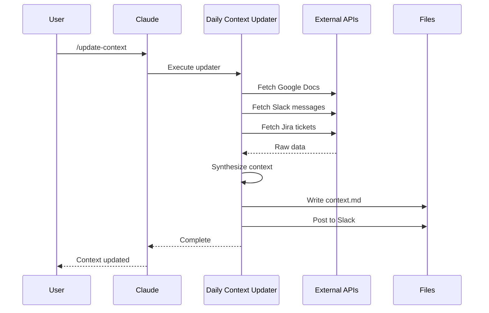
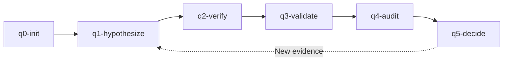

# PM-OS Workflows

> Key workflows for daily PM-OS usage

## Daily Workflow Overview

```mermaid
graph LR
    A[Morning] -->|/boot| B[Initialize]
    B -->|/update-context| C[Sync Context]
    C --> D[Work]
    D -->|throughout day| E{Meeting?}
    E -->|Yes| F[/meeting-prep]
    F --> D
    E -->|No| G{End of day?}
    G -->|No| D
    G -->|Yes| H[/session-save]
    H --> I[Done]
```

## 1. Boot Workflow

**Purpose**: Initialize PM-OS environment and load context.

**Command**: `/boot`

### What Happens

1. **Environment Setup**
   - Sets `PM_OS_ROOT`, `PM_OS_COMMON`, `PM_OS_USER` variables
   - Loads configuration from `user/config.yaml`

2. **Developer Command Sync**
   - If `developer/` folder exists, syncs commands to common
   - Makes Beads and roadmap commands available

3. **Pre-Flight Checks** (unless `--quick`)
   - Verifies all 88+ tools import correctly
   - Validates OAuth scopes

4. **Context Update** (unless `--quick`)
   - Fetches from GDocs, Slack, Jira
   - Creates daily context file

5. **Brain Loading**
   - Loads hot topics from context
   - Runs brain enrichment (unless `--quick`)

6. **Session Services**
   - Starts Confucius session notes
   - Captures roadmap items from Slack (unless `--quick`)

7. **Meeting Pre-reads** (unless `--quick`)
   - Generates prep docs for upcoming meetings

8. **Slack Notification** (unless `--quiet`)
   - Posts boot summary to configured channel

### Usage

```
/boot              # Full boot (all steps)
/boot --quick      # Fast startup (skip heavy steps)
/boot --quiet      # Skip Slack notification
```

### Expected Output

```
PM-OS Boot Complete

Environment:
  Root: /Users/you/pm-os
  Common: /Users/you/pm-os/common (v3.3)
  User: /Users/you/pm-os/user
  Developer: enabled

Context: 2026-01-13 loaded
Hot Topics: 12 items
Confucius: enabled

Ready for commands.
```

## 2. Context Update Workflow

**Purpose**: Sync latest information from integrations.

**Command**: `/update-context`

### What Happens



### Usage

```
/update-context           # Full update (default)
/update-context quick     # GDocs only
/update-context no-fetch  # Synthesize existing data only
/update-context jira      # Include Jira sync
```

### Context File Structure

Generated file `context/YYYY-MM-DD-context.md`:

```markdown
# Daily Context: 2026-01-13

## Critical Alerts
- Blocker: Payment gateway down
- Deadline: Q1 OKRs due Friday

## Key Decisions & Updates

### Project Alpha
- Sprint 12 started
- 3 stories in progress

## Blockers & Risks
| Blocker | Impact | Owner | Status |
|---------|--------|-------|--------|
| API delay | Launch | @dev | In Progress |

## Action Items
- [ ] **You** - Review PRD by EOD
- [ ] **Team** - Complete testing

## Key Dates
| Date | Event |
|------|-------|
| 2026-01-15 | Sprint Review |

## Documents Processed
| Document | Type |
|----------|------|
| PRD v2 | GDoc |
```

## 3. Session Management Workflow

**Purpose**: Save and resume conversations with context.

### Save Session

**Command**: `/session-save`

```mermaid
graph TD
    A[/session-save] --> B[Capture conversation]
    B --> C[Extract key decisions]
    C --> D[Compress context]
    D --> E[Write session file]
    E --> F[Return session ID]
```

### Load Session

**Command**: `/session-load [session-id]`

```mermaid
graph TD
    A[/session-load] --> B{ID provided?}
    B -->|Yes| C[Load specific session]
    B -->|No| D[List recent sessions]
    D --> E[User selects]
    E --> C
    C --> F[Restore context]
    F --> G[Resume conversation]
```

### Session Status

**Command**: `/session-status`

Shows:
- Current session state
- Loaded context
- Active Confucius notes

## 4. Meeting Preparation Workflow

**Purpose**: Generate pre-reads for upcoming meetings.

**Command**: `/meeting-prep`

### What Happens

1. **Calendar Check**
   - Fetches upcoming meetings from Google Calendar
   - Identifies attendees and topics

2. **Context Gathering**
   - Loads attendee profiles from Brain
   - Finds related projects and documents
   - Retrieves previous meeting notes

3. **Pre-read Generation**
   - Creates structured preparation document
   - Lists talking points
   - Suggests agenda items

### Usage

```
/meeting-prep              # Next meeting
/meeting-prep "1:1 with X" # Specific meeting by title
```

### Generated Pre-read

```markdown
# Meeting Prep: Sprint Planning

**Date**: 2026-01-13 10:00
**Attendees**: Alice, Bob, Charlie

## Attendee Context

### Alice (Engineering Lead)
- Working on: Payment refactor
- Recent: Shipped auth feature

### Bob (Designer)
- Working on: Mobile redesign
- Blocked on: API specs

## Related Projects
- Payment Gateway Migration (70% complete)
- Mobile App v2 (In Design)

## Suggested Agenda
1. Sprint 12 velocity review
2. Payment gateway blockers
3. Mobile API dependencies

## Previous Action Items
- [ ] Alice: API documentation
- [x] Bob: Wireframes complete
```

## 5. Document Generation Workflow

**Purpose**: Create PM documents with context awareness.

### PRD Generation

**Command**: `/prd`

```mermaid
graph TD
    A[/prd] --> B[Gather requirements]
    B --> C[Load Brain context]
    C --> D[Apply PRD template]
    D --> E[Generate sections]
    E --> F[Output PRD]
```

### Available Document Commands

| Command | Output | Use Case |
|---------|--------|----------|
| `/prd` | Product Requirements | New features |
| `/rfc` | Request for Comments | Technical proposals |
| `/adr` | Architecture Decision Record | Design decisions |
| `/bc` | Business Case | Justifications |
| `/prfaq` | PR/FAQ | Amazon-style |

### Workflow

1. **Initiate**: Run `/prd` (or other command)
2. **Gather**: Answer prompts about feature/topic
3. **Context**: PM-OS pulls relevant Brain data
4. **Generate**: Structured document created
5. **Review**: Edit and finalize
6. **Save**: Optionally sync to Confluence

## 6. FPF Reasoning Workflow

**Purpose**: Structured decision-making process.

**Commands**: `/q0-init` through `/q5-decide`



### Phases

| Phase | Command | Purpose |
|-------|---------|---------|
| Initialize | `/q0-init` | Define problem context |
| Hypothesize | `/q1-hypothesize` | Generate potential solutions |
| Verify | `/q2-verify` | Logical deduction |
| Validate | `/q3-validate` | Evidence-based induction |
| Audit | `/q4-audit` | Trust calculus |
| Decide | `/q5-decide` | Final recommendation |

### State Persistence

FPF state is saved in `user/brain/reasoning/`:
- `active-cycle.yaml` - Current cycle state
- `evidence/` - Supporting evidence files

## 7. Integration Sync Workflow

**Purpose**: Sync data from external tools.

### Jira Sync

**Command**: `/jira-sync`

Syncs:
- Sprint status
- Ticket updates
- Blocker information

### GitHub Sync

**Command**: `/github-sync`

Syncs:
- Open PRs
- Recent commits
- Issue status

### Confluence Sync

**Command**: `/confluence-sync`

Syncs:
- Page updates
- Comment threads

## 8. Ralph Development Workflow

**Purpose**: Iterative feature development.

**Commands**: `/ralph-init`, `/ralph-loop`, `/ralph-specs`

### Workflow

```mermaid
graph TD
    A[/ralph-init] --> B[Create feature folder]
    B --> C[Define PROMPT.md]
    C --> D[/ralph-loop]
    D --> E{Complete?}
    E -->|No| F[Iterate]
    F --> D
    E -->|Yes| G[Feature done]
```

### Files Created

```
user/planning/feature-name/
├── PROMPT.md      # Feature requirements
├── PLAN.md        # Implementation plan
├── ACCEPTANCE.md  # Acceptance criteria
└── iterations/    # Loop history
```

## 9. Push / Publication Workflow

**Purpose**: Publish PM-OS components to repositories.

**Command**: `/push`

### What Happens

```mermaid
graph TD
    A[/push] --> B{Target?}
    B -->|common| C[PR-based]
    B -->|brain/user| D[Direct push]

    C --> E[Checkout branch]
    E --> F[Stage changes]
    F --> G[Commit]
    G --> H[gh pr create]
    H --> I[Post to Slack]

    D --> J[Clone target repo]
    J --> K[Copy files]
    K --> L[Commit & push]
```

### Targets

| Target | Method | Repository |
|--------|--------|------------|
| `common` | Pull Request | feamando/pmos |
| `brain` | Direct push | personal/brain |
| `user` | Direct push | personal/user |

### Usage

```
/push                 # Push all enabled targets
/push common          # PR to pmos only
/push --dry-run       # Preview without pushing
/push --status        # Show last push info
```

### Configuration

Configure in `user/.config/push_config.yaml`:

```yaml
common:
  enabled: true
  repo: "feamando/pmos"
  branch: "PEP-276-pmos-general"
  push_method: "pr"
  slack_channel: "CXXXXXXXXXX"
brain:
  enabled: true
  repo: "your-username/brain"
  push_method: "direct"
```

---

## 10. Brain Enrichment Workflow

**Purpose**: Improve Brain graph density and relationship quality.

**Command**: `/brain-enrich`

### What Happens

```mermaid
graph TD
    A[/brain-enrich] --> B[Analyze baseline]
    B --> C[Run soft edge inference]
    C --> D[Scan for staleness]
    D --> E[Generate extraction hints]
    E --> F[Report improvements]
```

### Modes

| Mode | Steps | Use Case |
|------|-------|----------|
| `full` | All enrichers | Weekly maintenance |
| `quick` | Body text extraction only | Fast density boost |
| `report` | Analysis only | Status check |
| `boot` | Minimal checks | Boot integration |

### Metrics

The enrichment process tracks:
- **Orphan rate**: Entities without relationships (target: <30%)
- **Relationship density**: Avg relationships per entity
- **Staleness**: Relationships not verified recently

### Usage

```
/brain-enrich              # Full enrichment
/brain-enrich --quick      # Fast - body text only
/brain-enrich --report     # Analysis without changes
```

### Output

```
Brain Enrichment Complete

Baseline:
  Entities: 156
  Orphans: 52 (33.3%)
  Relationships: 284

After Enrichment:
  Orphans: 38 (24.4%)
  New relationships: +47
  Density: 2.1 → 2.4 rel/entity
```

---

## 11. Pre-Flight Workflow

**Purpose**: Verify system health before operations.

**Command**: `/preflight`

### What Happens

1. **Import Checks**: Verify all 88+ tool modules import
2. **Class Checks**: Confirm expected classes exist
3. **Config Checks**: Validate configuration present
4. **Env Checks**: Required environment variables set

### Categories

| Category | Tools | Examples |
|----------|-------|----------|
| core | 3 | config_loader, path_resolver |
| brain | 3 | brain_loader, brain_updater |
| integrations | 13 | Jira, GitHub, Slack, Google |
| session | 2 | Confucius, session_manager |
| quint | 4 | FPF reasoning tools |

### Usage

```
/preflight              # Full check
/preflight --quick      # Import tests only
/preflight --category core  # Specific category
```

### Output

```
PM-OS Pre-Flight Check

CORE (3/3)
  + config_loader (1/1 checks)
  + path_resolver (1/1 checks)
  + entity_validator (1/1 checks)

INTEGRATIONS (13/13)
  + jira_client (2/2 checks)
  ...

------------------------------------------------------------
Tools: 88/88 passed
Checks: 92/92 passed
Duration: 1200ms

STATUS: READY
```

---

## Best Practices

### Daily Routine

1. **Morning**: `/boot` then `/update-context`
2. **Before meetings**: `/meeting-prep`
3. **During work**: Use context-aware commands
4. **End of day**: `/session-save`

### Session Hygiene

- Save sessions before long breaks
- Use descriptive names for important sessions
- Clean up old sessions periodically

### Context Freshness

- Run `/update-context` at least once daily
- Use `quick` option for rapid refreshes
- Full sync includes Slack/Jira for comprehensive view

---

*Last updated: 2026-02-02*
*Confluence: [PM-OS Workflows](https://your-company.atlassian.net/wiki/spaces/PMOS/pages/workflows)*
