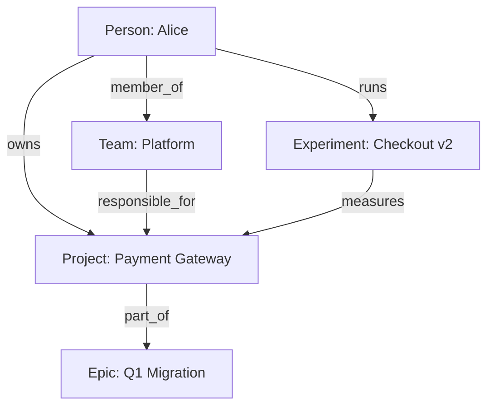
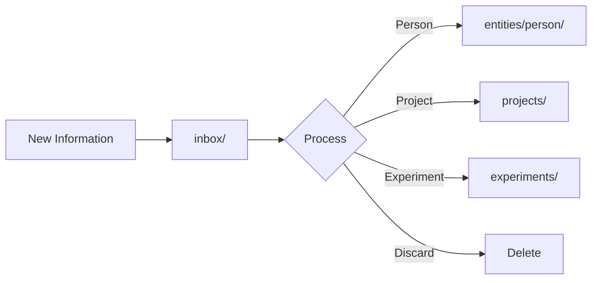

# Brain Architecture

> Knowledge management and persistent memory in PM-OS

## Overview

The Brain is PM-OS's persistent knowledge store. It maintains structured information about people, teams, projects, experiments, and decisions that Claude can access across sessions.

## Directory Structure

```
user/brain/
├── registry.yaml           # Master index of all entities
├── entities/               # People, teams, partners
│   ├── person/
│   │   ├── alice_smith.yaml
│   │   └── bob_jones.yaml
│   ├── team/
│   │   └── platform_team.yaml
│   └── partner/
│       └── vendor_acme.yaml
├── projects/               # Active work
│   ├── feature/
│   │   └── payment_gateway.md
│   └── epic/
│       └── q1_migration.md
├── experiments/            # A/B tests and flags
│   ├── ab_test/
│   │   └── checkout_flow_v2.yaml
│   └── flag/
│       └── dark_mode.yaml
├── strategy/               # OKRs and roadmaps
│   ├── okr/
│   │   └── q1_2026.yaml
│   └── roadmap/
│       └── 2026_h1.md
├── reasoning/              # FPF cycles
│   ├── active-cycle.yaml
│   └── evidence/
└── inbox/                  # Unprocessed items
    └── new_contact.yaml
```

## Registry

The `registry.yaml` file is the master index:

```yaml
version: "1.0"
last_updated: "2026-01-13T10:00:00Z"

entities:
  persons:
    - id: alice_smith
      name: "Alice Smith"
      file: entities/person/alice_smith.yaml
    - id: bob_jones
      name: "Bob Jones"
      file: entities/person/bob_jones.yaml

  teams:
    - id: platform_team
      name: "Platform Team"
      file: entities/team/platform_team.yaml

  partners:
    - id: vendor_acme
      name: "Acme Corp"
      file: entities/partner/vendor_acme.yaml

projects:
  features:
    - id: payment_gateway
      name: "Payment Gateway Migration"
      file: projects/feature/payment_gateway.md
      status: in_progress

  epics:
    - id: q1_migration
      name: "Q1 Platform Migration"
      file: projects/epic/q1_migration.md

experiments:
  ab_tests:
    - id: checkout_flow_v2
      name: "Checkout Flow v2 Test"
      file: experiments/ab_test/checkout_flow_v2.yaml
      status: running

  flags:
    - id: dark_mode
      name: "Dark Mode Feature Flag"
      file: experiments/flag/dark_mode.yaml
```

## Entity Schemas

### Person Schema

```yaml
# entities/person/alice_smith.yaml
id: alice_smith
type: person
name: "Alice Smith"
email: "alice.smith@company.com"
slack_id: "U0ALICE"

role:
  title: "Senior Engineer"
  team: platform_team
  reports_to: bob_jones

context:
  working_on:
    - payment_gateway
  expertise:
    - "Backend systems"
    - "Payment processing"
  communication_style: "Direct, prefers async"

relationships:
  - entity: bob_jones
    type: reports_to
  - entity: platform_team
    type: member_of

notes: |
  - Strong technical background
  - Leads payment initiatives
  - Available mornings PST

last_interaction: "2026-01-10"
created: "2025-06-15"
updated: "2026-01-10"
```

### Team Schema

```yaml
# entities/team/platform_team.yaml
id: platform_team
type: team
name: "Platform Team"

structure:
  lead: alice_smith
  members:
    - alice_smith
    - charlie_dev
    - dana_qa
  size: 3

responsibilities:
  - "Core platform services"
  - "Payment processing"
  - "Authentication"

rituals:
  standup: "Daily 9:30am"
  planning: "Monday 10am"
  retro: "Friday 3pm"

current_focus:
  - payment_gateway
  - auth_refactor

slack_channels:
  - "#platform-team"
  - "#platform-alerts"

jira:
  project_key: "PLAT"
  board_id: 123

created: "2024-01-01"
updated: "2026-01-13"
```

### Project Schema

```markdown
# projects/feature/payment_gateway.md

# Payment Gateway Migration

> Migrate from legacy gateway to new provider

## Status

| Field | Value |
|-------|-------|
| Status | In Progress |
| Owner | @alice_smith |
| Team | platform_team |
| Target | 2026-02-28 |
| Progress | 70% |

## Overview

Migrating payment processing from LegacyPay to NewPay for improved rates and features.

## Key Milestones

- [x] Requirements complete
- [x] API integration
- [ ] Testing complete
- [ ] Production rollout

## Blockers

| Blocker | Owner | Status |
|---------|-------|--------|
| API docs outdated | @vendor | Waiting |

## Decisions

- 2026-01-05: Chose gradual rollout over big bang
- 2025-12-15: Selected NewPay based on rates

## Related

- Epic: q1_migration
- Team: platform_team
- Experiment: checkout_flow_v2
```

### Experiment Schema

```yaml
# experiments/ab_test/checkout_flow_v2.yaml
id: checkout_flow_v2
type: ab_test
name: "Checkout Flow v2 Test"

status: running
started: "2026-01-01"
target_end: "2026-01-31"

hypothesis: |
  Simplified checkout will increase conversion by 5%

variants:
  - name: control
    allocation: 50
    description: "Current checkout flow"
  - name: treatment
    allocation: 50
    description: "Simplified 2-step flow"

metrics:
  primary:
    - name: conversion_rate
      target: "+5%"
  secondary:
    - name: cart_abandonment
      target: "-10%"
    - name: time_to_complete
      target: "-20%"

owner: alice_smith
team: platform_team

statsig:
  experiment_id: "checkout_v2_2026"
  gate: "checkout_experiment"

results:
  last_check: "2026-01-12"
  status: "inconclusive"
  notes: "Need more sample size"
```

## Brain Operations

### Loading Brain Data

```python
from brain_loader import load_entity, search_brain

# Load specific entity
person = load_entity("person", "alice_smith")

# Search across Brain
results = search_brain("payment")
```

### Updating Brain Data

```python
from brain_updater import update_entity, add_to_inbox

# Update existing entity
update_entity("person", "alice_smith", {
    "last_interaction": "2026-01-13"
})

# Add new unprocessed item
add_to_inbox({
    "type": "contact",
    "name": "New Vendor",
    "source": "email"
})
```

### Brain Commands

| Command | Purpose |
|---------|---------|
| `/brain-load` | Load entity into context |
| `/brain-search` | Search across Brain |
| `/brain-add` | Add new entity |
| `/brain-update` | Update existing entity |

## Relationships

Entities can reference each other:



## Inbox Workflow

New items go to `inbox/` for processing:



## Best Practices

### Entity Hygiene

1. **Regular updates**: Keep `last_interaction` current
2. **Link entities**: Use `relationships` to connect
3. **Archive stale**: Move completed projects to archive
4. **Review inbox**: Process inbox items weekly

### Naming Conventions

| Type | Convention | Example |
|------|------------|---------|
| Person | `firstname_lastname` | `alice_smith` |
| Team | `descriptive_name` | `platform_team` |
| Project | `short_name` | `payment_gateway` |
| Experiment | `feature_version` | `checkout_flow_v2` |

### File Organization

- One entity per file
- Use `.yaml` for structured data
- Use `.md` for rich documents
- Keep filenames lowercase with underscores

## Integration with Tools

### Meeting Prep

Pulls person context for attendee backgrounds.

### Document Generation

References related projects and decisions.

### Session Context

Loads relevant entities based on conversation.

### FPF Reasoning

Stores evidence and decision cycles.

## Schema Validation

Schemas are defined in `common/schemas/`:

```
schemas/
├── person.yaml
├── team.yaml
├── project.yaml
├── experiment.yaml
├── epic.yaml
├── okr.yaml
└── partner.yaml
```

See [Entity Schemas](schemas/entity-schemas.md) for full schema definitions.

---

*Last updated: 2026-01-13*
*Confluence: [PM-OS Brain Architecture](https://your-company.atlassian.net/wiki/spaces/PMOS/pages/brain)*
