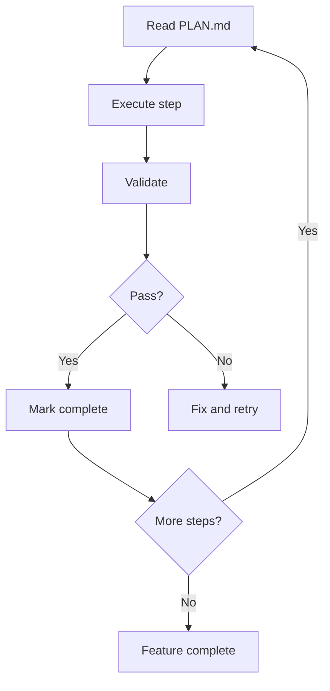

# Agent Commands

> Commands for specialized AI agents in PM-OS

## Overview

PM-OS includes specialized AI agents for different tasks:

| Agent | Purpose |
|-------|---------|
| Ralph | Iterative feature development |
| Confucius | Session notes and knowledge capture |
| Orthogonal | Challenge assumptions and validate |
| Quint | FPF reasoning bridge |
| Synapse | Knowledge connections |

## Ralph Commands

### /ralph-init

Initialize a Ralph feature development.

### Arguments

| Argument | Description |
|----------|-------------|
| `feature` | Feature name |
| `--from-prd` | Initialize from existing PRD |

### What It Does

1. Creates feature folder in `user/planning/`
2. Initializes PROMPT.md, PLAN.md, ACCEPTANCE.md
3. Sets up iteration tracking

### Created Structure

```
user/planning/<feature>/
├── PROMPT.md       # Feature requirements
├── PLAN.md         # Implementation plan
├── ACCEPTANCE.md   # Acceptance criteria
└── iterations/     # Loop history
```

### Usage

```
/ralph-init "User Authentication"
/ralph-init --from-prd ./products/auth_prd.md "User Auth"
```

---

### /ralph-loop

Run a Ralph iteration.

### Arguments

| Argument | Description |
|----------|-------------|
| `--feature` | Feature to iterate on |
| `--step` | Specific step to execute |

### What It Does

1. Reviews current state
2. Executes next implementation step
3. Validates against acceptance criteria
4. Updates progress tracking

### Loop Flow



### Usage

```
/ralph-loop
/ralph-loop --feature "User Authentication"
/ralph-loop --step 3
```

---

### /ralph-specs

Generate Ralph specifications.

### Arguments

| Argument | Description |
|----------|-------------|
| `feature` | Feature to spec |
| `--detailed` | Generate detailed specs |

### What It Does

1. Analyzes feature requirements
2. Generates technical specifications
3. Creates test scenarios
4. Defines acceptance criteria

### Usage

```
/ralph-specs "User Authentication"
/ralph-specs --detailed "Payment Flow"
```

---

### /ralph-status

Show Ralph feature status.

### Arguments

| Argument | Description |
|----------|-------------|
| `--all` | Show all features |
| `feature` | Specific feature |

### What It Shows

- Active features
- Iteration count
- Completion percentage
- Current step
- Blockers

### Usage

```
/ralph-status
/ralph-status --all
/ralph-status "User Authentication"
```

---

## Confucius Commands

### /confucius-status

Show Confucius session notes status.

### Arguments

None

### What It Shows

- Active session notes
- Key decisions captured
- Knowledge items pending
- Brain sync status

### How Confucius Works

Confucius silently observes sessions and:
- Captures key decisions
- Notes important context
- Tracks action items
- Identifies Brain-worthy knowledge

### Usage

```
/confucius-status
```

---

## Orthogonal Commands

### /orthogonal-status

Show orthogonal challenge status.

### Arguments

None

### What It Shows

- Active challenges
- Challenge round status
- Resolution progress

### How Orthogonal Works

Orthogonal challenges use Claude vs Gemini:
1. **Round 1 (Claude):** Initial proposal
2. **Round 2 (Gemini):** Challenge assumptions
3. **Round 3 (Claude):** Resolve and finalize

### Usage

```
/orthogonal-status
```

---

## Quint Commands

### /quint-sync

Sync Quint with Brain.

### Arguments

| Argument | Description |
|----------|-------------|
| `--to-brain` | Sync reasoning to Brain |
| `--from-brain` | Load Brain into Quint |

### What It Does

1. Transfers FPF state between Quint and Brain
2. Updates evidence references
3. Syncs decision records

### Usage

```
/quint-sync --to-brain
/quint-sync --from-brain
```

---

### /gemini-fpf

Bridge FPF reasoning to Gemini.

### Arguments

| Argument | Description |
|----------|-------------|
| `--query` | Send query to Gemini |
| `--validate` | Validate hypothesis with Gemini |

### What It Does

1. Formats FPF context for Gemini
2. Sends reasoning query
3. Integrates response into cycle

### Usage

```
/gemini-fpf --query "Validate technical feasibility"
/gemini-fpf --validate H1
```

---

## Other Agent Commands

### /synapse

Build knowledge connections.

### Arguments

| Argument | Description |
|----------|-------------|
| `topic` | Topic to analyze |
| `--connections` | Show connection graph |

### What It Does

1. Analyzes Brain entities
2. Identifies connections
3. Suggests related items
4. Builds knowledge graph

### Usage

```
/synapse "payments"
/synapse --connections
```

---

### /analyze-codebase

Analyze codebase structure.

### Arguments

| Argument | Description |
|----------|-------------|
| `--repo` | Repository path |
| `--scope` | Analysis scope |

### What It Does

1. Scans codebase structure
2. Identifies patterns
3. Documents architecture
4. Creates technical context

### Usage

```
/analyze-codebase
/analyze-codebase --repo /path/to/repo
```

---

### /pm

PM Assistant mode (NGO Style).

### Arguments

None

### What It Does

Activates PM assistant mode with:
- NGO communication style
- Context-aware responses
- Brain integration
- Action item tracking

### Usage

```
/pm
```

---

## Agent Configuration

Agents are configured in `user/config.yaml`:

```yaml
pm_os:
  confucius_enabled: true
  ralph_iterations_default: 10
  orthogonal_enabled: true

agents:
  ralph:
    max_iterations: 20
    auto_validate: true
  confucius:
    capture_decisions: true
    auto_brain_sync: true
```

---

## Agent State Storage

| Agent | State Location |
|-------|----------------|
| Ralph | `user/planning/<feature>/` |
| Confucius | `user/sessions/<id>-notes.md` |
| Orthogonal | `user/brain/reasoning/orthogonal/` |
| Quint | `user/brain/reasoning/` |

---

## Related Documentation

- [Workflows](../04-workflows.md) - Agent workflows
- [FPF Commands](fpf-commands.md) - FPF integration
- [Session Tools](../tools/session-tools.md) - Session management

---

*Last updated: 2026-01-13*
