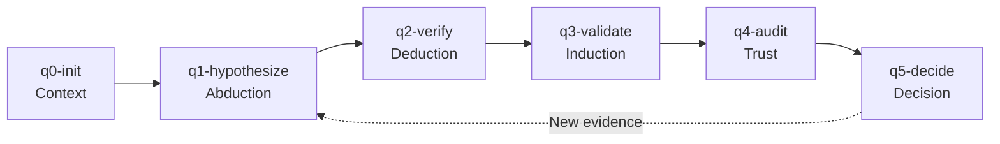

# FPF Commands

> First Principles Framework for structured reasoning and decision-making

## Overview

The First Principles Framework (FPF) provides a rigorous, auditable approach to decision-making. It uses a cycle of hypothesis generation, verification, validation, and trust assessment.



## /q0-init

Initialize FPF bounded context.

### Arguments

| Argument | Description |
|----------|-------------|
| `topic` | Decision topic or question |

### What It Does

1. Creates new FPF reasoning cycle
2. Establishes bounded context
3. Loads relevant Brain entities
4. Sets up state tracking

### State Created

```yaml
cycle_id: fpf-2026-01-13-001
topic: "Decision topic"
status: initialized
created: ISO timestamp
context:
  entities: [...]
  constraints: [...]
```

### Usage

```
/q0-init "Should we migrate to microservices?"
/q0-init "Payment provider selection"
```

---

## /q1-hypothesize

Generate hypotheses (abduction).

### Arguments

| Argument | Description |
|----------|-------------|
| `prompt` | Guidance for hypothesis generation |

### What It Does

1. Generates multiple hypotheses for the topic
2. Uses abductive reasoning
3. Records hypotheses with confidence levels
4. Identifies key assumptions

### Output

```yaml
hypotheses:
  - id: H1
    claim: "Microservices improve scalability"
    type: L1  # Claim level
    confidence: 0.7
    assumptions:
      - "Team has microservices experience"
      - "Infrastructure supports containers"
```

### Usage

```
/q1-hypothesize "What are the potential solutions?"
/q1-hypothesize "Consider cost, complexity, and timeline"
```

---

## /q1-add

Inject user hypothesis into cycle.

### Arguments

| Argument | Description |
|----------|-------------|
| `hypothesis` | User-provided hypothesis |
| `--rationale` | Reasoning for hypothesis |

### What It Does

1. Adds user hypothesis to active cycle
2. Tags as user-provided
3. Includes in verification queue

### Usage

```
/q1-add "We should use serverless functions"
/q1-add --rationale "Reduces ops overhead" "Serverless is optimal"
```

---

## /q2-verify

Verify hypotheses (deduction).

### Arguments

| Argument | Description |
|----------|-------------|
| `--hypothesis` | Specific hypothesis to verify |

### What It Does

1. Applies deductive reasoning
2. Checks logical consistency
3. Identifies contradictions
4. Updates confidence levels

### Output

```yaml
verification:
  hypothesis: H1
  status: verified
  logic_check: passed
  contradictions: []
  updated_confidence: 0.75
```

### Usage

```
/q2-verify
/q2-verify --hypothesis H2
```

---

## /q3-validate

Validate with evidence (induction).

### Arguments

| Argument | Description |
|----------|-------------|
| `--source` | Evidence source |
| `--hypothesis` | Hypothesis to validate |

### What It Does

1. Searches for supporting evidence
2. Applies inductive reasoning
3. Records evidence with provenance
4. Updates hypothesis confidence

### Evidence Types

| Level | Source | Trust Weight |
|-------|--------|--------------|
| L0 | Direct observation | High |
| L1 | Expert claim | Medium |
| L2 | Inference | Low |

### Usage

```
/q3-validate
/q3-validate --source "competitor analysis"
/q3-validate --hypothesis H1 --source "metrics data"
```

---

## /q4-audit

Audit evidence and trust (trust calculus).

### Arguments

| Argument | Description |
|----------|-------------|
| `--bias-check` | Run bias detection |
| `--full` | Complete audit |

### What It Does

1. Reviews evidence quality
2. Checks for cognitive biases
3. Assesses source reliability
4. Calculates trust scores

### Bias Checks

- Confirmation bias
- Anchoring
- Availability heuristic
- Sunk cost fallacy

### Output

```yaml
audit:
  trust_score: 0.82
  biases_detected:
    - type: anchoring
      severity: low
      mitigation: "Consider alternatives equally"
  evidence_quality: high
```

### Usage

```
/q4-audit
/q4-audit --bias-check
/q4-audit --full
```

---

## /q5-decide

Finalize decision and create DRR.

### Arguments

| Argument | Description |
|----------|-------------|
| `--recommendation` | Explicit recommendation |

### What It Does

1. Synthesizes reasoning cycle
2. Creates Design Rationale Record (DRR)
3. Documents decision and alternatives
4. Stores in Brain

### DRR Structure

```markdown
# DRR: Decision Topic

## Decision
[The decision made]

## Rationale
[Why this decision]

## Alternatives Considered
| Option | Pros | Cons | Score |
|--------|------|------|-------|

## Evidence
[Key evidence supporting decision]

## Conditions for Revisiting
[When to reconsider this decision]

## Assurance Level
[Confidence in this decision]
```

### Usage

```
/q5-decide
/q5-decide --recommendation "Proceed with Option A"
```

---

## /q-status

Show current FPF cycle status.

### Arguments

None

### What It Shows

- Active cycle ID and topic
- Current phase
- Hypotheses and their status
- Evidence collected
- Trust scores

### Usage

```
/q-status
```

---

## /q-reset

Reset the current FPF cycle.

### Arguments

| Argument | Description |
|----------|-------------|
| `--archive` | Archive before reset |

### What It Does

1. Clears active cycle state
2. Optionally archives to Brain
3. Ready for new cycle

### Usage

```
/q-reset
/q-reset --archive
```

---

## /q-query

Search the FPF knowledge base.

### Arguments

| Argument | Description |
|----------|-------------|
| `query` | Search query |
| `--type` | drr, evidence, hypothesis |

### What It Does

1. Searches Brain reasoning storage
2. Returns relevant DRRs and evidence
3. Shows related decisions

### Usage

```
/q-query "payment"
/q-query --type drr "architecture"
```

---

## /q-decay

Manage evidence freshness.

### Arguments

| Argument | Description |
|----------|-------------|
| `--check` | Check for expiring evidence |
| `--refresh` | Refresh stale evidence |

### What It Does

1. Reviews evidence age
2. Identifies expiring items
3. Suggests re-validation
4. Updates freshness scores

### Usage

```
/q-decay --check
/q-decay --refresh
```

---

## /q-actualize

Reconcile FPF state with repository changes.

### Arguments

| Argument | Description |
|----------|-------------|
| `--since` | Date to check from |

### What It Does

1. Scans for file changes
2. Identifies affected hypotheses
3. Flags evidence needing update
4. Suggests re-validation

### Usage

```
/q-actualize
/q-actualize --since 2026-01-01
```

---

## /quint-review

Review reasoning state.

### Arguments

None

### What It Does

Shows comprehensive view of:
- Active cycles
- Recent decisions
- Pending validations
- Trust scores

### Usage

```
/quint-review
```

---

## /quint-prd

Generate FPF-enhanced PRD.

### Arguments

| Argument | Description |
|----------|-------------|
| `topic` | PRD topic |

### What It Does

1. Runs full FPF cycle for PRD
2. Includes decision rationale
3. Documents alternatives
4. Links evidence

### Usage

```
/quint-prd "New feature X"
```

---

## State Storage

FPF state is stored in:

```
user/brain/reasoning/
├── active-cycle.yaml     # Current cycle
├── cycles/               # Archived cycles
│   └── fpf-YYYY-MM-DD-NNN.yaml
├── decisions/            # DRRs
│   └── DRR_topic.md
└── evidence/             # Evidence files
    └── E_YYYY-MM-DD-NNN.yaml
```

---

## Related Documentation

- [Overview](../01-overview.md) - FPF introduction
- [Workflows](../04-workflows.md) - FPF workflow
- [Document Commands](document-commands.md) - FPF with documents

---

*Last updated: 2026-01-13*
